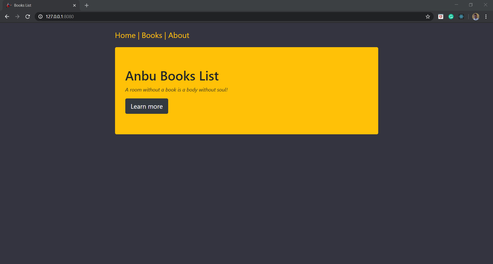
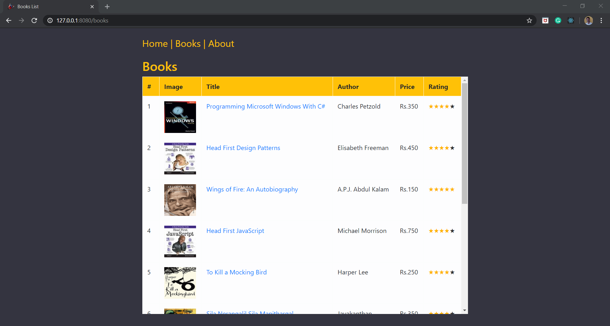
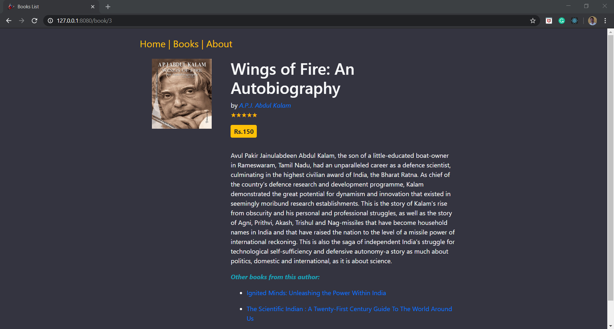
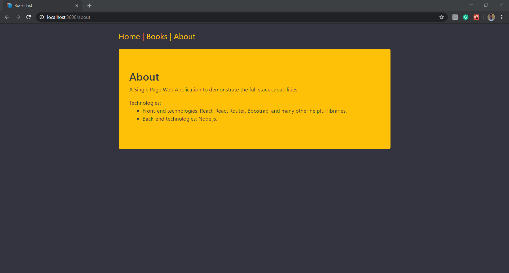

# spring-boot-react-booklist

### A single page web application to demonstrate the full stack architecture using react and spring-boot. 
    The data (books list) is stored in-memory to keep the solution simple.

## Application details:

1. Source Code structure.
   - The client-side are placed within the folder **frontend**.
   - The server-side are available within the **src** folder.
2. Server-side code organization:
   - The code is placed with in a separate package **com.bookslist.bookrestapi.book**
   - BookResource.java provides the necessary api for fetching data from the client-side.
   - The DTOs (BooksDto and BookDetailsDto) represents the response structure.
     - BooksDto: Represents the response for the api /books/. This returns the books list and the total count of the books.
     - BookDetailsDto: Represents the response for the api /books/:bookId. This returns the book details and the other books from the author.
   - The book images are placed separately in the static\images\ folder, which is automatically served by the spring-boot.
   - Express provides the server functionality and listens on the configured port.
2. Client-side code organization:
   - All the components are placed within their respective folder to have a clear separation.
   - Components, constants referred in other components are placed within the **common** folder.
   - Code design:
     - All the components are developed as functional components and use react-hooks.
     - Infinite scrolling is implemented manually. I have gone through a few custom components and finally decided to go with the custom implementation.
     - Star rating was is implemented using a custom component.The responsiveness of the screen is handled using bootstrap container-fluid and column layout.
   - Few notable libraries used:
     - Axios: Library for interacting with the server-side for fetching data.
     - Bootstrap: CSS Framework for styles and responsive design.

## SETUP

1. Server Setup:
   - Prerequisites: 
     - Install jdk (version 14.0.1)
     - Install maven (version: Apache Maven 3.6.3)
   - Open the command prompt and navigate to the project's root folder.
   - Type: mvn clean install
   - Type: mvn spring-boot run
   - Verify the installation by typing the executing this url "http://localhost:8080/books/1" in a new tab in your favourite browser (Chrome/Firefox).
2. Client setup   
   - **Install [Latest version of Node](https://nodejs.org)** if not already installed. Node version starting from 8 and greater should be fine.
   - Install the node packages as follows:
     - **Navigate to this project's root directory on the command line.**
     - **Type** - `npm install` - this should install all the dependencies.

## Running the application:

1. Navigate to this "frontend" folder if you're not already in that location.
2. To run in **development mode**, do the following:
   - Type **npm run start** and press enter.
   - In the browser, in a new tab, type "http://localhost:3000" and press enter.
   - By now, the home page should be visible, link on the menus at the top to navgiate through the application.
3. To run in **production mode**, do the following:
   - Type **npm run build** and press enter. This commands in parallel builds the application and starts the node server.
   - In the browser, in a new tab, type url (for e.g.  http://127.0.0.1:8081) where the server hosted the application  and press enter.
   - By now, the home page should be visible, link on the menus at the top to navgiate through the application.

_Note: The data required for the application are in-memory. There are no external test data at this moment._

## Screenshots

**Home Screen**

**Books list screen**

**Book details screen**

**Book details - responsive (smaller screen size)**

**About screen**

## Dependencies

### Production Dependencies

| **Dependency**   | **Use**                                              |
| ---------------- | ---------------------------------------------------- |
| bootstrap        | CSS Framework                                        |
| prop-types       | Declare types for props passed into React components |
| react            | React library                                        |
| react-dom        | React library for DOM rendering                      |
| react-router-dom | React library for routing                            |

### Development Dependencies

| **Dependency**          | **Use**                                                          |
| ----------------------- | ---------------------------------------------------------------- |
| @babel/core             | Transpiles modern JavaScript so it runs cross-browser            |
| babel-eslint            | Lint modern JavaScript via ESLint                                |
| babel-loader            | Add Babel support to Webpack                                     |
| babel-preset-react-app  | Babel preset for working in React. Used by create-react-app too. |
| css-loader              | Read CSS files via Webpack                                       |
| cssnano                 | Minify CSS                                                       |
| eslint                  | Lints JavaScript                                                 |
| eslint-loader           | Run ESLint via Webpack                                           |
| eslint-plugin-import    | Advanced linting of ES6 imports                                  |
| eslint-plugin-react     | Adds additional React-related rules to ESLint                    |
| html-webpack-plugin     | Generate HTML file via webpack                                   |
| http-server             | Lightweight HTTP server to serve the production build locally    |
| mini-css-extract-plugin | Extract imported CSS to a separate file via Webpack              |
| npm-run-all             | Display results of multiple commands on single command line      |
| postcss-loader          | Post-process CSS via Webpack                                     |
| rimraf                  | Delete files and folders                                         |
| style-loader            | Insert imported CSS into app via Webpack                         |
| webpack                 | Bundler with plugin ecosystem and integrated dev server          |
| webpack-bundle-analyzer | Generate report of what's in the app's production bundle         |
| webpack-cli             | Run Webpack via the command line                                 |
| webpack-dev-server      | Serve app via Webpack                                            |

